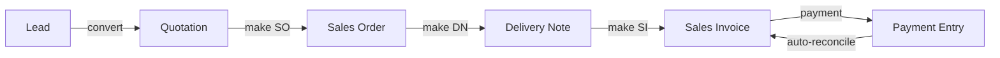

<div align="center">


# Instabiz

**Custom ERP layer for Instabiz Solutions India Pvt. Ltd.**  
Built on Frappe v15 + ERPNext v15 · Production · India-compliant


</div>

---

## 📖 Table of Contents

- [Overview](#overview)
- [Sales Pipeline](#-sales-pipeline)
- [Customer Management](#-customer-management)
- [Lead Management](#-lead-management)
- [Inventory & Stock](#-inventory--stock)
- [Finance & Accounting](#-finance--accounting)
- [GST Compliance](#-gst-compliance)
- [HR Management](#-hr-management)
- [Reports & Analytics](#-reports--analytics)
- [Notifications & Alerts](#-notifications--alerts)
- [Roles & Permissions](#-roles--permissions)
- [Custom Fields Reference](#-custom-fields-reference)
- [Architecture](#-architecture)

---

## Overview

Instabiz extends ERPNext with opinionated workflows, automation, and UI customizations specific to the manufacturing and distribution operations of Instabiz Solutions India Pvt. Ltd. — a tape and packaging manufacturer operating out of **Maharashtra, Chennai, and Gujarat**.

| | |
|---|---|
| **Stack** | Frappe v15, ERPNext v15, HRMS |
| **Site** | `frontend` |
| **Locations** | Maharashtra (BWD) · Chennai (CN) · Gujarat (SGM) |
| **Primary color** | `#d97757` (rust-orange) |

---

## 🔄 Sales Pipeline

The full order-to-cash cycle: **Quotation → Sales Order → Delivery Note → Sales Invoice**



### Location-Aware Naming

Every document is prefixed with a location code derived from `custom_location`:

| Location | Code | Example |
|---|---|---|
| Maharashtra (Mumbai) | `BWD` | `IB-BWD-SO-00042` |
| Chennai | `CN` | `IB-CN-DN-00015` |
| Gujarat | `SGM` | `IB-SGM-INV-00007` |

DN and SI share a global counter via **MySQL advisory lock** (`GET_LOCK('IB-DNSI', 5)`) to guarantee uniqueness across all sessions.

### Dimension-Based Quantity Calculation

Product dimensions drive quantity — no manual qty entry needed on SQMT items:

```
SQMT:  qty = (width_mm ÷ 1000) × length_mtr × qty_pkg × total_pkg
Other: qty = qty_pkg × total_pkg
amount = qty × rate  (2 dp)
```

Runs both server-side (`recalculate_items()` on validate) and client-side (debounced 500 ms on field change).

### Q → SO → DN → SI Mapper

Custom mappers carry all product dimensions, transport, location, billing/shipping addresses, and sales person across the chain. Rate contracts (ERPNext Pricing Rules) auto-apply on Quotation and SO — rates are locked at Q time and carried forward.

### SO Cancellation Reason

`custom_cancel_reason` is mandatory before a Sales Order can be cancelled. The field appears on submitted SO rows and is saved in the cancel audit trail.

---

## 👥 Customer Management

### Customer Board

> A 4-column Kanban showing each sales rep's daily customer workload.


| Column | Description |
|---|---|
| **Dormant** | Customers with no SO in the last N days (configurable threshold) |
| **Regular** | Customers with recent SO activity |
| **Today** | Manually added or auto-assigned for today |
| **Tomorrow** | Scheduler-assigned for the next working day |

**Key behaviors:**
- Sales reps add customers from the Dormant/Regular pool to Today
- 5-second undo toast on card removal
- SO submit auto-marks the assignment as **Order Placed**
- Monthly sales target card shown in the stats row
- Date picker — managers can browse past/future boards

### Daily Auto-Assignment Scheduler

Runs at midnight. For each active Sales User:

1. Rolls over yesterday's `Pending` assignments → `Rolled Over`
2. Calculates available slots: `assignments_per_day − existing_pending_count`
3. Splits slots by `dormant_ratio` (e.g. 50% dormant, 50% regular)
4. Backfills from the other pool if one runs short
5. Shuffles and inserts `IB Customer Assignment` records

> Users with **no territory mapping** receive **zero** auto-assignments — they must be added to a Lead Sales Team with territories configured.

**Config** (singleton `IB Assignment Config`):

| Field | Default | Description |
|---|---|---|
| `assignments_per_day` | 10 | Max assignments per user per day |
| `dormant_threshold_days` | 90 | Days without SO = Dormant |
| `dormant_ratio` | 50% | % of daily slots from dormant pool |

### Claim System

Managers can **claim** a customer — locking it to themselves so it won't appear in other reps' pools.

- **Single claim** — from the Customer form (Assign → Claim / Unclaim)
- **Bulk claim** — select rows in Customer list → Actions → Claim

### Assignment Admin

Manager-only view at `ib-assignment-admin`:


- Roster overview: avatar, pending count, contacted, orders placed, target progress bar
- **View as user** — loads any rep's full 4-column board; manager can add/remove on their behalf
- Pool assign panel — select user + date + customers → direct assignment with quota check

### Customer Health Score

Daily scheduler computes a 0–100 score for every active customer:

| Component | Weight |
|---|---|
| Payment punctuality | 35% |
| Order frequency | 30% |
| Complaint count | 20% |
| CSAT rating | 15% |

Status thresholds: 🟢 Green ≥ 70 · 🟡 Amber ≥ 40 · 🔴 Red < 40

If score drops ≥ 15 points day-over-day, an email alert is sent to all Sales Manager / System Manager users.

### Credit Limit Enforcement

Block SO submission when **both** conditions are met simultaneously:
- Total outstanding > `credit_limit`
- Oldest unpaid invoice older than `custom_days`

`bypass_credit_limit_check` on the Customer record skips the check entirely.

### Overdue Invoice Escalation

| Days Overdue | Action |
|---|---|
| 7 days | Bell notification to sales rep |
| 15 days | Bell notification to rep + all Sales Managers |
| 30 days | Bell notification + `custom_overdue_block = 1` set on Customer (blocks new SO) |

---

## 🎯 Lead Management

### Round-Robin Territory Assignment

Leads are assigned to reps based on Lead Sales Team territory mapping. Each team has:
- **Members** — Sales Users who receive leads
- **Territories** — Territory names this team covers

Assignment rotates through members in order.

### Lead Scoring

Auto-computed on every Lead save (0–100):

| Factor | Points |
|---|---|
| Temperature (Cold/Warm/Hot) | 0 / 30 / 60 |
| Status bonuses | Up to +30 |
| Mobile present | +5 |
| Email present | +3 |
| POI / Contact present | +2 |

### Activity Log

Every interaction is logged on the Lead timeline:


Types: **Call · Meeting · WhatsApp · Email · Visit**  
Outcomes: **Positive · Neutral · Negative · No Answer**

### Lead → Customer Conversion

Custom `make_customer()` carries: territory, pincode, city, district, lead_owner → sales person — all mapped correctly to Customer fields.

### Status Audit Trail

Every Lead status change (including row-picker changes from list view) creates a `Comment (type=Info)` visible on the Lead timeline: *"Status changed: Open → Qualified by user@example.com"*

### India Post Pincode Autofill

Typing a pincode on Lead, Customer, or Quotation auto-fills city and state from the India Post API.

---

## 📦 Inventory & Stock

### IB Stock Dashboard

> Live multi-warehouse stock view with WebSocket updates.


**Features:**
- Filter chips: Item Group, UOM (SQMT/PCS/KG), Warehouse, Hide Zero Stock, Show Zero Only
- Multi-token search with `<mark>` highlight
- Color dot swatches pulled from `IB_COLOR_MAP` (70+ color entries)
- Per-item breakdown popover: warehouse bars, reserved %, reorder status
- **WebSocket live updates** — subscribes to Bin changes; flashes changed rows
- CSV export with individual spec columns (Width, Length, Thickness, Color, Liner)
- State persistence in localStorage

### IB Stock Ledger

Filterable ledger per item / warehouse / date range. Deep-linked from Stock Dashboard row click. Shows SLE entries with party name resolution (Customer/Supplier from linked DN, SI, SO, PR, PI, PO).

### IB Price List

Custom page `ib-price-list` (not the doctype list view):

- Table with multi-token search and spec rendering
- Color dots, spec tags, UOM chips (orange SQMT / blue PCS / green KG)
- Row click → popover with Rate 1–4 (color-coded: blue / purple / orange / teal)
- Managers can edit rates inline via toolbar button

### Batch Tracking Auto-Set

Item groups `BOPP`, `CLOTH`, `FOAM`, `SPECIALTY` auto-set `has_batch_no = 1` on item save.

### Item Reorder Alert

Daily scheduler compares `tabBin` qty vs item reorder level per warehouse. Sends Notification Log to Purchase Manager / Purchase User / System Manager. 7-day cooldown per item.

### Packaging Specification

Per-item fields for DN packing list generation:

| Field | Description |
|---|---|
| `custom_rolls_per_box` | Rolls per carton |
| `custom_carton_weight_kg` | Net carton weight |
| `custom_carton_marking` | Text printed on carton label |

### IB Packing List

Jinja print format on Delivery Note. Per row: item, qty, UOM, rolls/box, no. of boxes, carton weight, total weight, carton marking. LR number in header. Three signature lines footer.

---

## 💰 Finance & Accounting

### Payment Entry Auto-Reconcile

On Receive Payment Entry submit (no manual references):
1. Finds all open Sales Invoices for the customer
2. Allocates FIFO oldest-first until PE amount exhausted
3. Appends rows to `references` table and calls `set_amounts()`

### Advance Payment Tracking on SO

`custom_advance_paid` field on Sales Order shows total advance received against the SO (sum of submitted Receive PEs referencing it). Updates on PE submit and cancel.

### Credit Notes (Sales Returns)

Sales Invoice with `is_return = 1`. `custom_return_reason` mandatory free-text field appears only on returns. `recalculate_items()` is skipped for return docs to preserve ERPNext's negated quantities.

### IB PDC (Post-Dated Cheques)

Doctype `IB PDC` tracks received cheques:

| Status | Meaning |
|---|---|
| Pending | Received, not yet presented |
| Presented | Sent to bank |
| Cleared | Bank confirmed |
| Bounced | Cheque bounced |
| Cancelled | Voided |

3-day-ahead presentation alert sent daily to Accounts team and the linked sales rep.

### AR / AP Aging Reports

Outstanding invoices bucketed by age:

`0–30 days` · `31–60 days` · `61–90 days` · `90+ days`

Color-coded: 🟢 → 🟡 → 🟠 → 🔴

---

## 🧾 GST Compliance

### E-Invoice (IRN) Auto-Generation

Fires on Sales Invoice submit:
- Skips: returns, debit notes, B2C (no GSTIN), already-IRN docs
- Calls `generate_e_invoice()` via `india_compliance`
- Non-blocking — warns on NIC failure without throwing
- Guards against error 2278 (cancelled IRN cannot be regenerated for same doc number)

**NIC credentials configured** for all 3 GSTINs:

| GSTIN | State | Status |
|---|---|---|
| 27AAECI3431Q1Z8 | Maharashtra | ✅ Live |
| 24AAECI3431Q1ZE | Gujarat | ⏳ Pending NIC portal |
| 33AAECI3431Q1ZF | Tamil Nadu | ⏳ Pending NIC portal |

### E-Way Bill Auto-Generation

Fires on Delivery Note submit. Ships-from address is overridden per warehouse location:

| Warehouse | Ships From |
|---|---|
| `MAHARASHTRA - IB` | Maharashtra company address |
| `GUJARAT - IB` | Gujarat company address |
| `CHENNAI - IB` | Chennai company address |

**Dialog enhancements on DN list view:**

Transaction Type selector (Regular / Bill To–Ship To / Bill From–Dispatch From / Combination) with conditional address fields injected into the Frappe e-Waybill dialog. Distance auto-calculated from pincode geocoding.

### IB Tax Invoice Print Format

2-page Jinja2 print format on Sales Invoice:

| Page | Content |
|---|---|
| 1 | Tax Invoice with IRN QR code, company/buyer details, items table with per-row GST, CGST/SGST/IGST rows, amount in words, bank details |
| 2 | E-Way Bill with EWB QR code, address details (From/To + Dispatch/ShipTo), goods table, transport + vehicle details |

---

## 👷 HR Management

### Attendance Check-in Portal

Employee self-service at `/checkin`. Shift-aware late/early detection:
- Late check-in (> 10 min past shift start) → mandatory reason dialog
- Early check-out (> 10 min before shift end) → mandatory reason dialog
- Normal timing → immediate check-in/out

### Auto-Absent Marking

Daily scheduler marks yesterday's employees **Absent** if no Attendance record exists. Skips: weekends, holidays (per employee's holiday list), approved leave applications.

### State-wise Holiday Lists

Three lists configured for FY 2026:
- Holiday List 2026 – Maharashtra
- Holiday List 2026 – Tamil Nadu
- Holiday List 2026 – Gujarat

### Employee Exit Handover

On `relieving_date`:
1. Scheduler creates `Employee Exit Handover` document
2. HR reassigns open leads, quotations, SOs, etc. via Quick Assign All
3. User is disabled on `relieving_date + 1`

### IB Overtime Request

Doctype `IB Overtime Request` — employee submits, HR Manager approves/rejects.

### IB Full & Final Settlement

Auto-computes on validate:
- `years_of_service` = date_diff ÷ 365
- `gratuity_amount` = (basic ÷ 26) × 15 × yos (if ≥ 5 years)
- `leave_encashment` = (basic ÷ 26) × pending_leaves (if not set manually)
- `total_payable` = leave_encashment + gratuity + pending_expenses

### HRMS Payroll

Two salary structures: **IB Payroll** and **Astro Payroll**

<details>
<summary>IB Payroll Formulas</summary>

| Component | Formula |
|---|---|
| Basic (B) | `base × 2/3` |
| HRA | `base × 0.2` |
| CA | `base − B − HRA` |
| PF | `min(B + CA, 15000) × 12%` |
| ESIC | `(B + HRA) × 0.75%` if base ≤ 21000 |
| PT | ₹175 if base ≤ 10000 else ₹200 (Male, base ≥ 7500) |

</details>

---

## 📊 Reports & Analytics

All reports are **Script Reports** with a `chart_type` filter (bar/pie/donut/line/percentage).

| Report | Description |
|---|---|
| **IB Sales KPIs** | Per-rep: Leads, Quotations, Orders, conversion %, revenue, avg deal size |
| **IB Daily Sales Report** | Single-date snapshot: new leads, Q/SO/DN counts + values, MTD revenue vs target |
| **IB Lost Deal Analysis** | Lost leads + quotations by source, reason, territory, sales person |
| **IB Territory Report** | Per-territory leads, orders, revenue, conversion % |
| **IB SKU Report** | Per-item: orders, qty sold, revenue, avg rate, customer count |
| **IB Gross Margin Report** | Per-item: revenue, COGS, gross profit, margin % (color-coded) |
| **IB Collections Report** | Per-rep: invoiced, collected, outstanding, collection % |
| **IB AR Aging** | Outstanding SI bucketed by age (0–30/31–60/61–90/90+) |
| **IB AP Aging** | Outstanding PI bucketed by age |
| **IB Credit Note Register** | Sales returns with reason, customer, territory, return value |
| **IB Dispatch Report** | Per-DN: customer, location, transporter, LR, items, value |
| **IB Stock Ageing** | Per-item/warehouse: qty, first receipt date, age buckets, value |

---

## 🔔 Notifications & Alerts

All notifications are in-app bell alerts via `Notification Log`. Email used only for health score drops.

| Alert | Trigger | Recipient |
|---|---|---|
| **Dormant Customer** | No SO in 60+ days | Sales rep (includes WhatsApp wa.me link) |
| **Sales Target Milestone** | 50% / 75% month elapsed + EOM | Rep if behind pace |
| **Customer Health Drop** | Score drops ≥ 15 pts | All Sales Managers (email) |
| **Fulfillment SLA** | SO with no DN after 48 h | Sales rep |
| **Win-back Nudge** | Open Q inactive 14 d / Cold lead inactive 30 d | Rep / Lead owner |
| **Quotation Expiry** | 15 / 7 / 1 days before valid_till | Rep; auto-expire on day-of |
| **Follow-up Reminder** | `custom_next_follow_up_date` passed | Lead owner |
| **Item Reorder Alert** | Bin qty ≤ reorder level | Purchase team |
| **Batch Expiry Alert** | Expiry within 30 days | Warehouse / Purchase team |
| **PO Follow-up** | PO with no GRN after 7 days | Purchase team |
| **Vendor Payment Due** | PO payment schedule due in 7 days | Purchase team |
| **Overdue Invoice** | 7 / 15 / 30 days overdue | Rep → Managers → block |
| **PDC Presentation** | Cheque date = today + 3 | Accounts team + sales rep |
| **Dispatch Notification** | DN submitted | Sales rep |
| **Payment Received** | PE submitted | Accounts team |
| **Comment on Q/SO** | Comment added | `custom_sales_person_user` |

---

## 🔐 Roles & Permissions

### Role Matrix

| Feature | Sales User | Sales Manager | Accounts User | Purchase User | HR Manager | System Manager |
|---|---|---|---|---|---|---|
| Create Q / SO | ✅ own | ✅ all | — | — | — | ✅ |
| Cancel SO | ✅ + reason | ✅ | — | — | — | ✅ |
| Claim customer | — | ✅ | — | — | — | ✅ |
| Assign to user | — | ✅ | — | — | — | ✅ |
| View all boards | — | ✅ | — | — | — | ✅ |
| Bypass floor price | — | ✅ | — | — | — | ✅ |
| Create PDC | ✅ | ✅ | ✅ | — | — | ✅ |
| Approve overtime | — | — | — | — | ✅ | ✅ |
| Set sales target | — | ✅ | — | — | — | ✅ |

### Data Isolation

Non-privileged users (Sales User) see **only their own documents** across Quotation, Sales Order, Delivery Note, and Sales Invoice — enforced via `permission_query_conditions` and `has_permission` hooks in `permissions.py`.

---

## 🧩 Custom Fields Reference

### Sales Documents (Q / SO / DN / SI)

| Field | Type | Description |
|---|---|---|
| `custom_sales_person_user` | Link → User | Auto-set from session user; drives permissions |
| `custom_sales_person` | Data | Display name |
| `custom_location` | Select | maharashtra / chennai / gujarat |
| `custom_sale_type` | Select | Local / Export (clears taxes on Export) |
| `custom_cancel_reason` | Small Text | Mandatory before SO cancel |
| `custom_advance_paid` | Currency | Sum of advance PEs linked to SO |

### Item Child Table

| Field | Type | Description |
|---|---|---|
| `color` | Data | Product color (supports multi-color `A/B`) |
| `width_mm` | Float | Roll width in mm |
| `length_mtr` | Float | Roll length in metres |
| `qty_pkg` | Float | Qty per package |
| `total_pkg` | Float | Number of packages |
| `custom_valuation_rate` | Currency | Item cost at time of quotation |
| `custom_margin_pct` | Percent | `(rate − cost) / rate × 100` |

### Customer

| Field | Type | Description |
|---|---|---|
| `ib_claimed_by` | Link → User | Manager who claimed this customer |
| `custom_overdue_block` | Check | Set at 30d overdue; blocks new SO |
| `custom_outstanding_amount` | Currency | Live outstanding from `get_customer_outstanding()` |
| `custom_bill_and_ship_to_same_address` | Check | Copy billing → shipping on change |

### Employee

| Field | Description |
|---|---|
| `custom_emergency_contact` | Emergency contact name |
| `custom_emergency_phone` | Emergency phone number |
| `custom_notice_period_days` | Default 30 |
| `custom_previous_employer` | Prior company name |
| `custom_location_state` | Maharashtra / Tamil Nadu / Gujarat |

---

## 🏗 Architecture

### Override Pattern

```python
class CustomSalesOrder(IbStatusMixin, SalesOrder):
    STATUS_MAP = {"Draft": "Draft", "To Deliver and Bill": "Active", ...}

    def validate(self):
        set_sales_person(self)
        recalculate_items(self)
        _check_floor_price(self)
        super().validate()
```

Registered in `hooks.py → override_doctype_class`. `IbStatusMixin` remaps status values and bypasses Frappe's select validation.

### Scheduler Architecture

```
hooks.py → scheduler_events
  ├── daily     → run_daily_assignment, run_dormant_check, run_customer_score, ...
  ├── daily     → run_auto_absent, run_quotation_expiry, run_follow_up_reminders, ...
  └── daily     → run_pdc_alert, run_overdue_alert, run_vendor_payment_alert, ...
```

All scheduler functions are idempotent and include deduplication markers in Notification Log subjects (e.g. `[ib-dormant-reminder]`, `[ib-pdc-{name}]`).

### Key Files

| File | Purpose |
|---|---|
| `overrides/utils.py` | Shared utilities: `recalculate_items`, `reopen_sales_doc`, field mappers, floor price check |
| `overrides/customer_assignment.py` | Customer board backend: pools, scheduler, claim/assign |
| `overrides/permissions.py` | Query conditions + `has_permission` for all 4 sales doctypes |
| `overrides/naming.py` | `autoname_*` functions + advisory-lock global counter |
| `overrides/einvoice.py` | IRN auto-generation on SI submit |
| `overrides/ewaybill.py` | E-way bill auto-generation on DN submit + dialog injection |
| `overrides/payment_entry.py` | Auto-reconcile + SO advance tracking + accounts notification |
| `public/js/form.js` | Global sales doc handlers (Reopen, recalc triggers, cancel guard) |
| `public/js/list_utils.js` | Shared list helpers: status multiselect, e-waybill dialog injection |
| `public/js/recalc.js` | Client-side dimension qty calc with 500 ms debounce |

---

<div align="center">
<sub>Instabiz Solutions India Pvt. Ltd. · Internal use only</sub>
</div>
